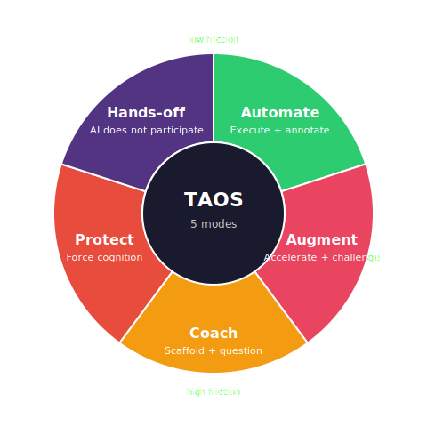

# Talent-Augmenting Layer — Personalised AI Augmentation Layer

[](https://creativecommons.org/licenses/by-nc-sa/4.0/)
[]()
[]()

> **Works with**: ChatGPT | Claude (Code / Desktop / web) | Gemini | Cursor | Windsurf | Codex CLI | Any LLM

> Make workers better, not dependent. A personalised AI augmentation system that follows you across every platform.

---

## What Is This?

Talent-Augmenting Layer (TAL) is a **personalised AI augmentation layer** that transforms how AI interacts with you. It works with any LLM, on any platform, through a 4-tier architecture designed for cross-platform portability. Instead of treating you as a generic user, TAL:

1. **Assesses** your expertise, goals, work style, and growth areas using the TALQ (Talent-Augmenting Layer Questionnaire)
2. **Creates** a living profile in portable markdown that calibrates all AI interactions to YOUR context
3. **Adapts** — coaching you in areas where you're growing, accelerating you where you're expert, automating what should be automated, and protecting skills at risk of atrophying
4. **Evolves** — your profile updates as you grow, keeping the AI aligned with your changing needs
5. **Travels with you** — the same profile works in ChatGPT, Claude, Gemini, Cursor, Windsurf, or any LLM

**The core insight**: AI that does everything for you makes you worse over time. AI that knows WHEN to help, WHEN to coach, WHEN to challenge, and WHEN to step back makes you permanently better.

---

## The Problem

Current AI tools have one mode: **maximum helpfulness**. This creates three failure patterns:

| Pattern | What Happens | Research Evidence |
|---------|-------------|-------------------|
| **De-skilling** | Workers lose skills they stop practicing | Clinicians using AI for 3 months performed WORSE after removal than before (2024-25 studies) |
| **Over-reliance** | Workers accept AI output without critical evaluation | Humans with AI perform better than humans alone but WORSE than AI alone — because they blindly accept wrong suggestions (Buçinca 2021) |
| **Autopilot** | Workers disengage from cognitive work | Junior employees who "just hand in" AI work perform worse than those who engage critically (Mollick 2023) |

**Talent-Augmenting Layer exists to prevent all three.**

---

## How It Works

### Architecture: 4 Tiers

Talent-Augmenting Layer is a **layer**, not a product tied to one platform. It works through 4 tiers, from zero-dependency copy-paste to a full hosted web app:

```
┌─────────────────────────────────────────────────────────────────┐
│  Tier 4: Hosted Web App + Remote MCP                            │
│  Browser-based · Google OAuth · LLM assessment · email check-ins│
│  Streamable HTTP + SSE endpoint at /mcp (OAuth 2.1 + PKCE)      │
├─────────────────────────────────────────────────────────────────┤
│  Tier 3: MCP Server (local + 1-click installers)                │
│  14 tools · 5 resources · 4 prompts · automatic tracking        │
│  • stdio for Claude Code / Cursor / Windsurf                    │
│  • Desktop Extension (.mcpb) for Claude Desktop                 │
│  • Claude Cowork plugin marketplace (.claude-plugin)            │
├─────────────────────────────────────────────────────────────────┤
│  Tier 2: Platform-Native                                        │
│  Custom GPTs · Gemini Gems · Claude Projects                    │
│  Persistent context · conversation starters                     │
├─────────────────────────────────────────────────────────────────┤
│  Tier 1: Universal System Prompt                                │
│  Any LLM · zero dependencies · copy-paste setup                 │
└─────────────────────────────────────────────────────────────────┘
                              │
                              ▼
┌─────────────────────────────────────────────────────────────────┐
│                  profiles/pro-{name}.md                          │
│  Portable markdown · same format across all tiers               │
│  Identity · Expertise Map · TALQ Scores · Task Classification   │
│  Growth Trajectory · Contrast Libraries · Red Lines             │
└─────────────────────────────────────────────────────────────────┘

All tiers share: same TALQ instrument, same scoring,
same profile format, same behavioural rules.
```

> Full system diagram (Mermaid) in [`docs/ARCHITECTURE.md`](docs/ARCHITECTURE.md).

### Core Concepts (Domain, Skill, Task)

Three words get used a lot; they mean different things.

| Term | What it means | Example |
|---|---|---|
| **Domain** | An area of expertise. Rated 1–5 in your profile's Expertise Map. | `Negotiation`, `Python`, `Stakeholder writing` |
| **Skill** | Your rated competency within a domain. Also the noun for anything that can atrophy. | "My Python skill is 4/5 but it's slipping." |
| **Task** | A unit of work. Each task is triaged into one of five **modes** (see below). | "Draft an ISO policy stub", "Write this email", "Design the auth flow" |

In short: tasks happen in domains, and your profile rates your skill in each domain. The five modes below say *how* the AI should behave for a given task given your skill in that domain.

### The Five Modes

<p align="center">
  
</p>

Every task gets classified into one of five AI interaction modes:

| Mode | AI Role | Friction | Example |
|------|---------|----------|---------|
| **Automate** | Execute + annotate | Low | Data cleanup, formatting, boilerplate |
| **Augment** | Accelerate + challenge | Low-Med | Research in expert domains, code in proficient areas |
| **Coach** | Scaffold + question | Med-High | Skills you're actively developing |
| **Protect** | Force cognition + teach | High | Skills at risk of atrophying from AI over-use |
| **Hands-off** | Don't touch | N/A | Tasks that are core to your human identity and judgment |

### Research-Backed Techniques

| Technique | Source | When Used |
|-----------|--------|-----------|
| **Cognitive Forcing** | Buçinca et al. (2021) | Novice domains, high-stakes decisions — ask for user's hypothesis first |
| **Contrastive Explanations** | Buçinca et al. (2024) | Learning moments — explain the DELTA between user's mental model and reality |
| **Adaptive Support** | Buçinca et al. (2024) | All interactions — adjust friction based on user state |
| **Expert Augmentation** | Mollick (2023) | Expert domains — skip basics, challenge assumptions, accelerate |
| **De-skilling Protection** | Multiple (2024-25) | Protected skills — add friction, require human-first attempts |

---

## Quick Start

New to Claude Code and TAL MCP? Start with the first-time guide: `docs/CLAUDE_CODE_FIRST_TIME_SETUP.md`.

Pick the option that matches your setup:

| Option | Time | What You Need |
|--------|------|---------------|
| **Any LLM** | 2 min | Access to any LLM with custom instructions |
| **Custom GPT / Gem / Project** | 5 min | ChatGPT Plus, Gemini, or Claude account |
| **Claude Desktop extension** | 1 click | Double-click `desktop-extension/talent-augmenting-layer.mcpb` |
| **Claude Cowork plugin** | 1 click | Install from the `.claude-plugin` marketplace |
| **Remote MCP (hosted)** | sign-in | Any MCP client that supports Streamable HTTP + OAuth |
| **MCP Server (stdio)** | 10 min | Python + an MCP client (Claude Code, Cursor, Windsurf) |
| **Hosted Web App** | 15 min | Docker or Python + Google Cloud OAuth |

### Any LLM (2 min)

1. Paste `universal-prompt/ASSESSMENT_PROMPT.md` into a conversation. Answer the questions. Save the generated profile.
2. Paste `universal-prompt/SYSTEM_PROMPT.md` + your profile into your LLM's custom instructions.
3. Done. The AI now adapts to your expertise, coaches your growth areas, and protects your skills.

### Custom GPT / Gem / Project (5 min)

Pre-configured instances with persistent context and conversation starters:
- **ChatGPT**: Import `platform-configs/chatgpt-gpt.json` as a Custom GPT
- **Gemini**: Follow `platform-configs/gemini-gem.md` to create a Gem
- **Claude**: Follow `platform-configs/claude-project.md` to set up a Project

### Claude Desktop Extension (1 click)

Prebuilt `.mcpb` bundle — no Python setup, no config editing:

1. Download `desktop-extension/talent-augmenting-layer.mcpb`.
2. Double-click to install in Claude Desktop.
3. Pick where your profiles should live, then run `talent-assess`.

Profiles are stored locally (default: `~/.talent-augmenting-layer/profiles/`). No cloud, no API keys.

### Claude Cowork Plugin (1 click)

Install from the `.claude-plugin` marketplace — ships three Claude Code skills (`talent-assess`, `talent-coach`, `talent-update`) plus the MCP server config in `plugin/.mcp.json`.

### Remote MCP (hosted, OAuth)

For MCP clients that support Streamable HTTP + OAuth (e.g. Claude Desktop MCP Connector), point them at:

```
https://proworker-hosted.onrender.com/mcp
```

Sign in with Google; your profile persists in the hosted PostgreSQL database. See `docs/REMOTE_MCP_SETUP.md` and `server.json`.

### MCP Server (10 min, local stdio)

Full tool integration with automatic tracking. Works with Claude Code, Claude Desktop, Cursor, Windsurf, Codex CLI, Zed, VS Code MCP — any client that follows the MCP stdio spec.

```bash
cd mcp-server && pip install -e .
```
Add to your MCP client config (shape is the same across clients):
```json
{
  "mcpServers": {
    "talent-augmenting-layer": {
      "command": "python",
      "args": ["-m", "src.server"],
      "cwd": "/path/to/talent-augmenting-layer/mcp-server",
      "env": {
        "TALENT_AUGMENTING_LAYER_PROFILES_DIR": "/path/to/talent-augmenting-layer/profiles"
      }
    }
  }
}
```

Config-file locations (common):
- Claude Code: project-local `.mcp.json` or user `~/.claude/mcp.json`.
- Claude Desktop: `~/Library/Application Support/Claude/claude_desktop_config.json` (macOS).
- Cursor: `~/.cursor/mcp.json`.
- Windsurf: `~/.codeium/windsurf/mcp_config.json`.
- Codex CLI: `~/.codex/config.json` (merge the `mcpServers` block in; see [`platform-configs/codex-cli.json`](platform-configs/codex-cli.json) for a ready-made file). If your Codex version expects TOML, translate the block into `[mcp_servers.talent-augmenting-layer]` style and verify against the latest Codex docs.

Run `talent-assess` as an MCP prompt to create your profile. If you want the Claude Code slash command `/talent-assess`, open this repository in Claude Code so it loads `.claude/commands/`, or copy those command files into `~/.claude/commands/`.

### Hosted Web App

Browser-based app with Google login, LLM-powered assessment, and email check-in reminders:
```bash
cd hosted && docker build -t talent-augmenting-layer . && docker run -p 5000:5000 --env-file .env talent-augmenting-layer
```
See `hosted/README.md` for full setup (OAuth credentials, LLM API key, SMTP config).

### Day-to-Day Commands (MCP / Claude Code)
- `/talent-assess` — Run initial assessment or full re-assessment
- `/talent-update` — Update profile based on recent interactions
- `/talent-coach` — Start a targeted coaching session on a specific skill

These slash commands are separate from the MCP server prompts. The MCP server exposes `talent-assess`, `talent-coach`, and `talent-update` as prompts. In MCP usage, the conversation is powered by your selected client model (for example, your Claude Code model), while the server provides tools and profile storage.

See `docs/integration-guide.md` for detailed platform-specific instructions.

---

## Cross-Platform Portability

Talent-Augmenting Layer is designed as a **layer** -- not tied to any specific tool, LLM, or platform. The 4-tier architecture means it works everywhere:

| Tier | Platforms | Setup |
|------|-----------|-------|
| **Tier 1**: Universal prompt | ChatGPT, Claude, Gemini, Copilot, Perplexity, any LLM API | Copy-paste (2 min) |
| **Tier 2**: Platform-native | ChatGPT Custom GPTs, Gemini Gems, Claude Projects | Pre-configured instance (5 min) |
| **Tier 3**: MCP Server (stdio) | Claude Code, Cursor, Windsurf | pip install + config (10 min) |
| **Tier 3**: Desktop Extension (.mcpb) | Claude Desktop | 1-click install |
| **Tier 3**: Claude Cowork plugin | Claude Code plugin marketplace | 1-click install |
| **Tier 3**: Remote MCP (Streamable HTTP + OAuth) | Any MCP client with remote support | Google sign-in |
| **Tier 4**: Hosted web app | Any browser | Docker deploy (15 min) |

The profile is **portable markdown** -- it works anywhere you can inject system context. Take your profile from Claude Code to ChatGPT to Cursor and back. Your AI calibration follows you.

---

## Research Foundation

Built on empirical research, not opinions:

| Source | Key Finding | How We Use It |
|--------|-------------|---------------|
| Buçinca et al. (2021) | Cognitive forcing reduces over-reliance by ~30% | Ask for hypothesis before revealing AI's answer |
| Buçinca et al. (2024) | Contrastive explanations improve skills +8% (d=0.35) | Explain delta between user's model and AI's |
| Buçinca et al. (2024) | Optimal AI support depends on individual state | Personalize via profile, adapt dynamically |
| Mollick et al. (2023) | AI: +40% quality, +26% speed — but juniors who "just hand in" do worse | Protect against autopilot, especially in growth areas |
| Drago & Laine (2025) | The Intelligence Curse: humans must stay complementary | Build skills that maintain human economic relevance |
| Acemoglu | Pro-worker AI should increase human marginal product | Every interaction should make the user more valuable |
| Vygotsky | Zone of Proximal Development | Scaffold just beyond current ability |
| Ericsson | Deliberate Practice | Practice at edge of ability with feedback |
| Deci & Ryan | Self-Determination Theory | Protect autonomy, build competence |
| Dweck | Growth Mindset | Frame friction as opportunity |

---

## File Structure

```
talent-augmenting-layer/
├── CLAUDE.md                           # Core system prompt (the brain)
├── README.md                           # This file
├── CITATION.cff                        # Machine-readable citation metadata
├── LICENSE                             # CC BY-NC-SA 4.0
├── COPYRIGHT                           # Attribution notice
├── .claude/
│   ├── commands/
│   │   ├── talent-assess.md         # /talent-assess slash command
│   │   ├── talent-update.md         # /talent-update slash command
│   │   └── talent-coach.md          # /talent-coach slash command
│   └── settings.local.json            # Claude Code permissions
├── .claude-plugin/
│   └── marketplace.json               # Claude Cowork plugin marketplace entry
├── plugin/                             # Claude Code plugin source (bundled skills + .mcp.json)
│   ├── .claude-plugin/plugin.json
│   ├── .mcp.json                       # MCP server config shipped with the plugin
│   └── skills/                         # talent-assess · talent-coach · talent-update skills
├── desktop-extension/                  # Claude Desktop 1-click extension
│   ├── manifest.json                   # .mcpb manifest (MCP + user config schema)
│   ├── talent-augmenting-layer.mcpb    # Prebuilt bundle — double-click to install
│   └── src/                            # Bundled server (assessment, profile_manager, server)
├── server.json                         # MCP registry manifest (Streamable HTTP remote)
├── render.yaml                         # Render deployment (hosted service + PostgreSQL)
├── universal-prompt/                   # Tier 1: Works with any LLM
│   ├── SYSTEM_PROMPT.md                # Full system prompt (~4k tokens)
│   ├── SYSTEM_PROMPT_COMPACT.md        # Compact version for token-limited platforms
│   ├── ASSESSMENT_PROMPT.md            # Self-contained assessment prompt
│   └── QUICK_START.md                  # Step-by-step setup instructions
├── platform-configs/                   # Tier 2: Pre-configured platform instances
│   ├── chatgpt-gpt.json               # ChatGPT Custom GPT configuration
│   ├── gemini-gem.md                   # Gemini Gem setup guide
│   └── claude-project.md              # Claude Project setup guide
├── mcp-server/                         # Tier 3: Cross-platform MCP server
│   ├── pyproject.toml                  # Package config
│   ├── README.md                       # MCP server docs
│   └── src/
│       ├── server.py                   # MCP tools, resources, prompts (14 tools)
│       ├── profile_manager.py          # Profile CRUD, parsing, interaction logging
│       └── assessment.py               # Embedded assessment engine (questions, scoring)
├── hosted/                             # Tier 4: Standalone web application
│   ├── app.py                          # Flask application (routes, OAuth, assessment)
│   ├── config.py                       # Environment configuration
│   ├── database.py                     # Database models and persistence
│   ├── llm_client.py                   # LLM integration for conversational assessment
│   ├── scoring.py                      # TALQ scoring engine
│   ├── auth.py                         # Google OAuth authentication
│   ├── email_service.py                # 2-week check-in email reminders
│   ├── scheduler.py                    # Background task scheduling
│   ├── templates/                      # HTML templates (login, assessment, dashboard, checkin)
│   ├── static/                         # CSS and JavaScript
│   ├── requirements.txt                # Python dependencies
│   ├── Dockerfile                      # Container deployment
│   └── README.md                       # Hosted app setup guide
├── assessment/
│   ├── framework.md                    # Assessment methodology
│   ├── scoring-instrument.md           # TALQ psychometric instrument
│   ├── coaching-modules.md             # Structured coaching sessions (5 modules, 13 sessions)
│   ├── ab-testing-framework.md         # A/B testing design for outcomes research
│   └── literature-foundations.md       # Research backing
├── dashboard/
│   └── app.py                          # Streamlit org-level analytics dashboard
├── web-ui/
│   └── index.html                      # Standalone web assessment UI
├── docs/
│   ├── ARCHITECTURE.md                 # System architecture (Mermaid diagram)
│   ├── integration-guide.md            # 4-tier integration guide
│   ├── CLAUDE_CODE_FIRST_TIME_SETUP.md # First-run walkthrough for Claude Code
│   └── REMOTE_MCP_*.md                 # Remote MCP setup, implementation, verification
├── profiles/
│   ├── TEMPLATE.md                     # Blank profile template
│   └── pro-angelo.md                   # Example: Angelo's profile
└── context/                            # Research papers (Buçinca, Acemoglu, Mollick)
```

> **Related project**: [Talent-Augmenting Layer Benchmark](https://github.com/angelo-leone/pro-worker-benchmark) -- a 3-layer evaluation framework for measuring whether LLMs augment or replace human intelligence.

---

## What Makes This Different From Memory?

Good question. Memory stores facts. **Talent-Augmenting Layer is how memory is used.**

| Feature | Plain Memory | Talent-Augmenting Layer |
|---------|-------------|---------------|
| Stores user info | Yes | Yes |
| Adapts AI behaviour | No — just recalls | Yes — systematically calibrates every interaction |
| Protects skills | No | Yes — cognitive forcing, de-skilling prevention |
| Coaches growth | No | Yes — targeted scaffolding in growth areas |
| Classifies tasks | No | Yes — automate/augment/coach/protect/hands-off |
| Evolves over time | Appends facts | Tracks skill progression, adjusts calibration |
| Research-backed | No | Yes — grounded in HCI and workforce learning literature |

Memory is the database. **TAL is the operating system.**

---

## Contributing

This is an open-source personalised AI augmentation layer. Current status:

- [x] Core system prompt with 4 interaction modes (CLAUDE.md)
- [x] Interactive assessment with profile generation (TALQ)
- [x] Psychometric scoring instrument with validated Likert scales
- [x] Tier 1: Universal system prompt for any LLM (4 files)
- [x] Tier 2: Platform-native configs for ChatGPT, Gemini, Claude (3 files)
- [x] Tier 3: MCP server with 14 tools, 5 resources, 4 prompts
- [x] Tier 4: Hosted web app with Google OAuth, LLM assessment, email check-ins
- [x] Embedded chatbot-driven onboarding (any MCP client can run the assessment)
- [x] Organisation-level dashboard (Streamlit)
- [x] Skill progression tracking with trend analysis and atrophy detection
- [x] 4-tier integration guide with cross-platform sync
- [x] A/B testing framework for outcomes research
- [x] Streamable HTTP + SSE transport for remote MCP clients (OAuth 2.1 + PKCE)
- [x] Claude Desktop Extension (`.mcpb`) for 1-click install
- [x] Claude Cowork plugin marketplace entry (`.claude-plugin`)
- [x] Published hosted remote MCP endpoint at `proworker-hosted.onrender.com/mcp`
- [x] Google Drive anonymised export for pilot telemetry
- [ ] Integration with existing L&D platforms
- [ ] Multi-user benchmarking and anonymized comparisons
- [ ] API middleware for any LLM provider
- [ ] Mobile-friendly assessment UI

---

## License

This work is licensed under the [Creative Commons Attribution-NonCommercial-ShareAlike 4.0 International License](https://creativecommons.org/licenses/by-nc-sa/4.0/).

**You are free to** share and adapt this work for non-commercial purposes, as long as you give appropriate credit and distribute contributions under the same license.

See [LICENSE](LICENSE) for the full text.

---

## Citation

If you use Talent-Augmenting Layer in research or publications, please cite:

```bibtex
@software{leone2026talentaugmentinglayer,
  author    = {Leone, Angelo},
  title     = {Talent-Augmenting Layer: A Personalised AI Augmentation Layer for Workforce Development},
  version   = {0.2.0},
  year      = {2026},
  url       = {https://github.com/angelo-leone/talent-augmenting-layer},
  license   = {CC-BY-NC-SA-4.0}
}
```

Or see [CITATION.cff](CITATION.cff) for machine-readable citation metadata.

---

*Built by Angelo Leone at PUBLIC. Powered by research from Buçinca, Acemoglu, Mollick, Drago & Laine.*
*Every interaction should leave you more capable, not more dependent.*

Copyright (c) 2026 Angelo Leone. All rights reserved under CC BY-NC-SA 4.0.
