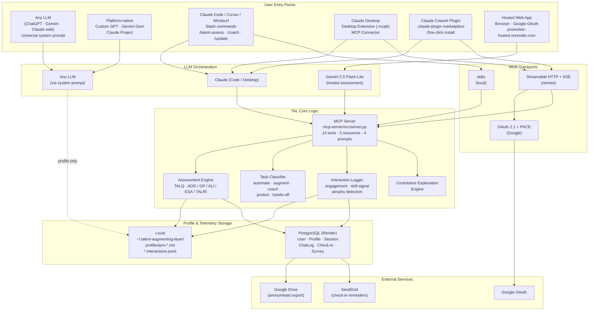

# Talent-Augmenting Layer — Architecture

> A layered, platform-portable system. Same TALQ instrument, same scoring, same profile format across every entry point.

---

## System Diagram (Mermaid)

---

## Tier Overview

| Tier | Surface | Transport | Storage | Setup |
|------|---------|-----------|---------|-------|
| **1** | Any LLM | Copy-paste prompt | Profile pasted into custom instructions | 2 min |
| **2** | Custom GPT / Gem / Claude Project | Platform-native | Profile in project context | 5 min |
| **3a** | Claude Code / Cursor / Windsurf | MCP stdio | Local `~/.talent-augmenting-layer/` | 10 min |
| **3b** | Claude Desktop | Desktop Extension (.mcpb) | Local | 1-click |
| **3c** | Claude Cowork plugin | `.claude-plugin` marketplace | Local | 1-click |
| **3d** | Remote MCP clients | Streamable HTTP + OAuth | Hosted PostgreSQL | Sign-in |
| **4** | Hosted web app | HTTPS browser | PostgreSQL + optional Drive export | Sign-in |

All tiers share the same 14-tool MCP surface and the same portable markdown profile.

---

## MCP Tool Surface (14 tools)

**Profile management** — `talent_get_profile`, `talent_get_calibration`, `talent_status`, `talent_list_profiles`, `talent_save_profile`, `talent_delete_profile`
**Assessment** — `talent_assess_start`, `talent_assess_score`, `talent_assess_create_profile`, `talent_suggest_domains`
**Runtime** — `talent_classify_task`, `talent_log_interaction`, `talent_get_progression`
**Org** — `talent_org_summary`
**Telemetry** — `talent_parse_telemetry` (extracts `<tal_log>` JSON from LLM responses)

---

## Key Files

- `mcp-server/src/server.py` — MCP tool surface (stdio + remote)
- `desktop-extension/manifest.json` — Claude Desktop `.mcpb` package
- `.claude-plugin/marketplace.json` + `plugin/` — Claude Cowork plugin
- `server.json` — MCP registry manifest (Streamable HTTP remote)
- `hosted/app.py` — FastAPI hosted web app
- `hosted/mcp_sse_handler.py` + `hosted/mcp_oauth.py` — Remote MCP transport + OAuth
- `render.yaml` — Deployed service + managed PostgreSQL
- `CLAUDE.md` — Behavioural system prompt loaded into every session
- `profiles/pro-*.md` — Portable markdown profile (the calibration layer)

---

## Data Flow: A Coaching Session

1. User runs `/talent-coach` in Claude Code.
2. Claude Code invokes the MCP server (stdio or remote).
3. Server calls `talent_get_profile` → loads `pro-{name}.md`.
4. Server calls `talent_classify_task` → returns `coach` mode for the target skill.
5. Claude generates a scaffolded response using contrastive explanations from the profile's contrast library.
6. `talent_log_interaction` records engagement + skill signal.
7. Over time, `talent_get_progression` surfaces growth or atrophy trends.
